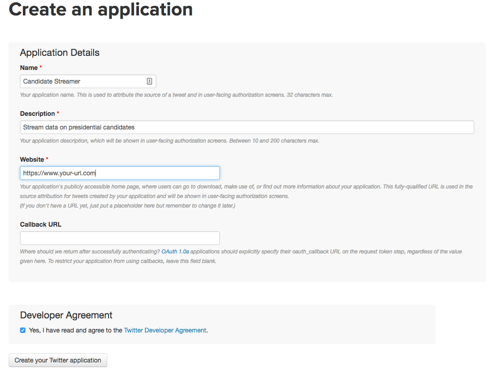
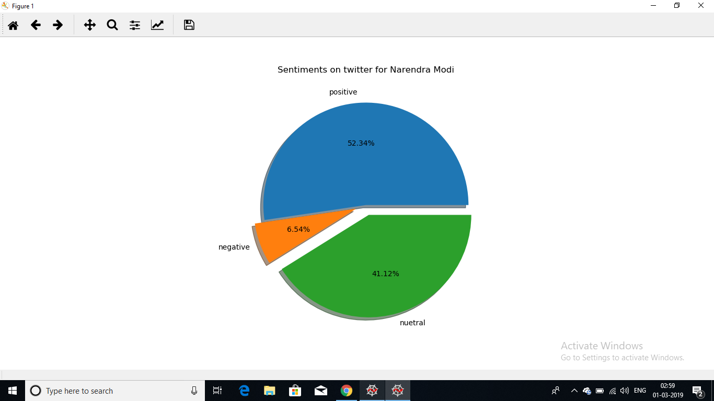
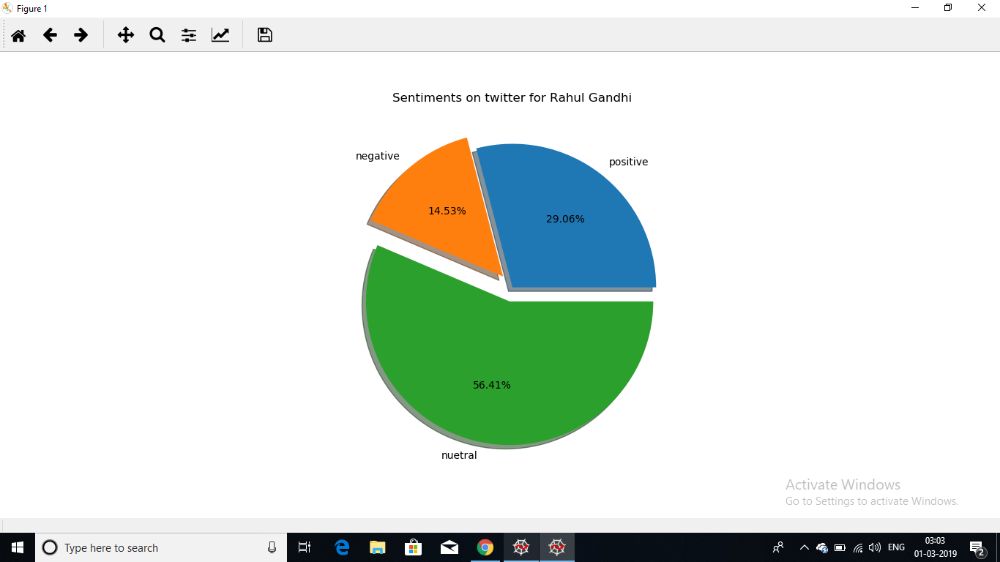

# Sentiment_Analysis_using_Twitter
A tool for analysing the sentiments of public on a topic using their tweets about the topic
Twitter is a social network where people post short, 140-character, status messages called tweets,because tweets are sent out continuously, Twitter is a great way to figure out how people feel about current events. In this post, we'll create a tool that enables us to find out how people feel about two great Indian Leaders. To do this, we'll need to:

Stream tweets from the Twitter API.

Filter out the tweets that aren't relevant.

Process the tweets to figure out what emotions they express about each candidate.

Store the tweets for additional analysis.

# The Twitter Streaming API

We setup a program to get tweets in real-time — let's called this the streamer.

In order to make it easy to work with real-time tweets, Twitter provides the Twitter Streaming API. There are quite a few rules about how to stream tweets from Twitter, but the main ones are:

Create a persistent connection to the Twitter API, and read each connection incrementally.

Process tweets quickly, and don't let your program get backed up.

Handle errors and other issues properly.

The most popular is tweepy, which allows you to connect to the streaming API and handle errors properly.

# Setting up Tweepy

To setup tweepy for start streaming data. The first thing we'll need to do is visit the Twitter Developer Center and create a developer account. This account will enable us to create credentials that let us authenticate with the Twitter Streaming API.

After creating the account, we can go to the Application Console and create a new Twitter application. This will let us get credentials specific to the application, which will let us connect to the API.

Once you create your application, you can click on the "Keys and Access Tokens" tab to get your credentials. You'll need to get the following from under "Application Settings":

Consumer Key (API Key) — we'll refer to this as TWITTER_APP_KEY.

Consumer Secret (API Secret) — we'll refer to this as TWITTER_APP_SECRET.

You'll also need to do the following in the section under "Your Access Token":

Click "Create my access token"

Get the value called Access Token — we'll refer to this as TWITTER_KEY.

Get the value called Access Token Secret — we'll refer to this as TWITTER_SECRET.

Enter these values in the code wherever reuired and start streaming the tweets.

# Processing the tweets
Because we're interested in the emotion of people, we'll want to analyze the text of each tweet to figure out the sentiments it expresses.

We can use a method called sentiment analysis to tag each tweet with a sentiment score, from -1 to 1. A -1 means that the tweet is very negative a 0 is neutral, and a 1 means that the tweet is very positive. Sentiment analysis tools typically generate this score by seeing if words known to indicate negative and positive sentiment occur in a string. For example, if the word hate occurs in a string, it is more likely to be negative. Because sentiment analysis is essentially string matching, it is extremely quick to work, which is important for us, since the longer we take to process, the more likely that we'll fall behind on processing tweets and be disconnected.

In order to perform sentiment analysis, we can use a library called TextBlob, which allows us to do sentiment analysis in Python, among other natural language processing tasks.

# Storing the tweets
Once we have all the data we want on each tweet, we're ready to store it for later processing. It's possible to store our data in a csv file, but a csv file makes it hard to query the data. If we want to read from a csv file, we either have to load the whole thing, or go through a convoluted process to query and only load the pieces we want.

A good place to store our data is in a database. Because they are commonly used and easy to query, we'll use a relational database. SQLite is the simplest to use major relational database, as it doesn't require any processes to be running, and everything is stored in a single file.

In order to access the database, we'll use the dataset package, which makes it extremely simple to access a database and store data. Instead of creating a database and tables, we simply store data, and the dataset package will take care of automatically creating the database and all the tables we need.

We have to first connect to our database using a connection string

When using SQLite, if the database file doesn't exist, it will be automatically created in the current folder.
# Visualising the Analysis
For visualizing the sentiments expressed by various people using tweets we can use a pie chart to represent the amount of people feeling positive, negative or nuetral towards the topic.

Matplotlib.pyplot can be used for plotting graphs in python and the data can be visualised as:

# Storing tweets in a csv file
Tweets can be saved in a csv file for any further use to store the streamed tweets in the databse to a csv file db_to_csv.py can be used
